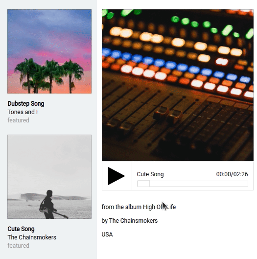
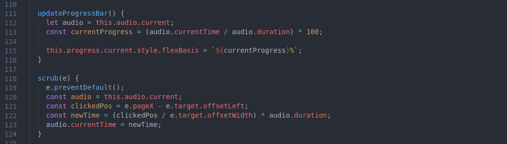

# Welcome to Bandlamp

Bandlamp is a pixel perfect" clone of www.bandcamp.com providing users the ability to create an account, and browse through a collection of artist's pages, their associated albums and to playback and listen to an album's tracks. User's can also create their own albums and upload an image and some music and listen to them on their own artist's page. Some of Bandlamps key features a custom audio player, fully searchable database that returns results for artists, albums, and tracks, polymorphic genre tags, and a quick, responsive design for seamless browsing and listening.

---

## Check it out at https://bandlamp.herokuapp.com/#/

---

---

---

# The Stack

- Ruby
- Ruby on Rails
- Javascript
- React
- React-Redux
- AWS S3
- Heroku
- HTML
- CSS

---

---

# Feature Highlights

## Custom Audio Player

The custom `<AudioPlayer>` component was designed to be modular so it could be re-used in multiple locations throughout the application. This was accomplished by setting the component up to always receive the direction of which audio track to play from props, by way of a special `AudioPlayerReducer`, rather than to have it fetch or request any information itself. I have used the `<AudioPlayer>` in the "Discover" section of the splash page as well as in individual album show pages. However, this organization could potentially allow for the `<AudioPlayer>` to be placed just about anywhere in the application.

### Some of it's key features are:

- Play/pause toggle
- Actively calculated time updates, rendered to a readable format of `00:00/00:00`
- Dynamic progress bar with back and from scrubbing.
- Updating song title.

---

### Code Snippet from <AudioPlayer>

---

code to calculate progress bar update and update on scrub from `<AudioPlayer>`

---

---

## Search Bar

The search bar presented a few sets of challenges for me. One was the returns from a single search needed to return 3 different sets of data. That is to say, it needed to run the search for matches in `Users`, `Albums`, and `Tracks` and return the results in an organized way for rendering on the front end.
